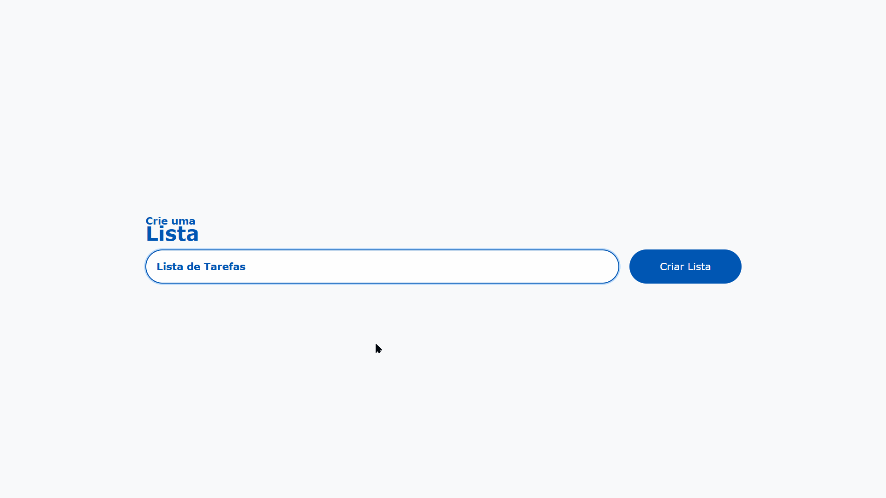
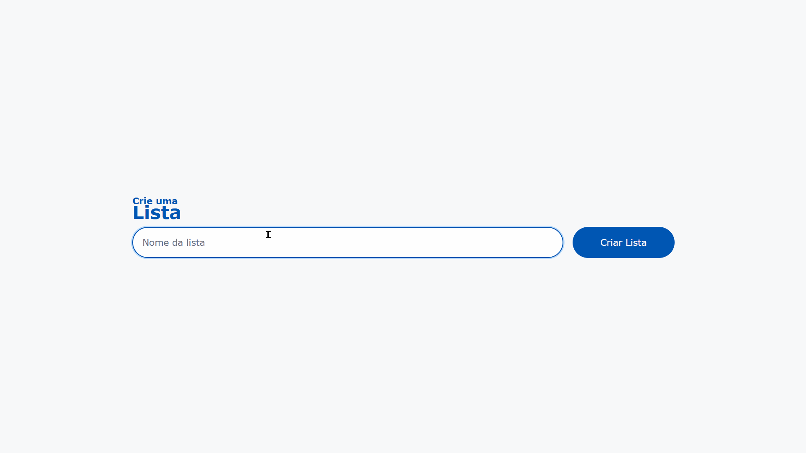

<!-- markdownlint-disable MD033 -->

# 📋 Mini-App de Lista Dinâmica com Adição e Remoção

🎯 Um app simples e direto para criar listas personalizadas com validação e interação visual.

## ✨ Funcionalidades

- Adicionar nome à lista
- Exibir nome com botão de remoção
- Remover itens individualmente
- Validação de campos com mensagens visuais (erro, sucesso, atenção)

## 📸 Screenshots

### Interface inicial

<p align="center">
    
</p>

### Alertas visuais

- ✅ Sucesso (ao adicionar um nome válido)

  <p align="center">
    
  </p>

- ❌ Erro (ao tentar adicionar um campo vazio)

  <p align="center">
    
  </p>

- ⚠️ Atenção (ao tentar adicionar um nome com menos de 3 caracteres)

  <p align="center">
    
  </p>

## 🧠 Tecnologias utilizadas

- HTML5
- CSS3
- JavaScript (DOM Manipulation)

## 🔧 Como rodar localmente

1. Baixe ou clone este repositório:

   ```sh
   git clone https://github.com/mateusaraujos/mini-app-lista
   ```

2. Acesse a pasta do projeto:

   ```sh
   cd mini-app-lista
   ```

3. Abra o arquivo `index.html` no navegador.

## 🚀 Deploy

🔗 Acesse o projeto online:

- [](https://mateusaraujos.github.io/mini-app-lista/)
- [](https://mini-app-lista.vercel.app)

## 📁 Estrutura de pastas

```sh
mini-app-lista/
├── index.html
├── style.css
├── script.js
└── assets/
    ├── interfaceInicial.png
    ├── alerta_sucesso.gif
    ├── alerta_erro.gif
    └── alerta_atencao.gif
```

## 👤 Feito por

- [](https://github.com/mateusaraujos)
- [](https://www.linkedin.com/in/mateusaraujos/)
