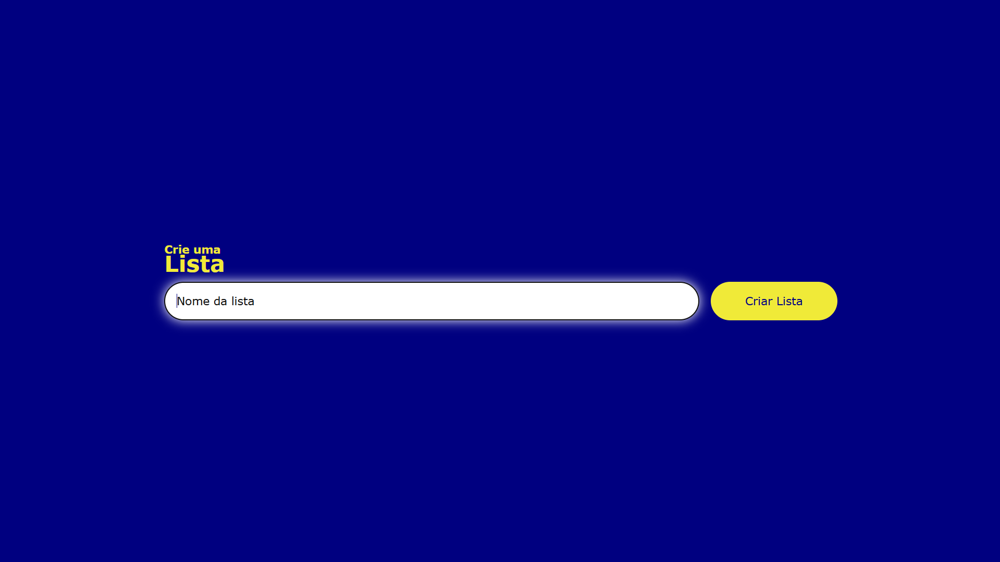

<!-- markdownlint-disable MD033 -->

# Um Mini-App de Criação de Listas

🎯 Com este App, você é capaz de criar listas com nomes personalizados.

## 🧠 Tecnologias utilizadas

- HTML5
- CSS3
- JavaScript

## 📸 Screenshots

Veja como está a interface do projeto:

<p align="center">
    
</p>

## 🔧 Como rodar localmente

1. Baixe ou clone este repositório:

   ```sh
   git clone https://github.com/mateusaraujos/mini-app-lista
   ```

2. Abra a pasta do projeto no seu computador.
3. Clique duas vezes no arquivo `index.html` ou abra-o no seu navegador preferido.

## 🚀 Deploy

🔗 Acesse o projeto em:

- [](https://mateusaraujos.github.io/mini-app-lista/)
- [](https://mini-app-lista.vercel.app)

## Feito por

- [](https://github.com/mateusaraujos)
- [](https://www.linkedin.com/in/mateusaraujos/)
