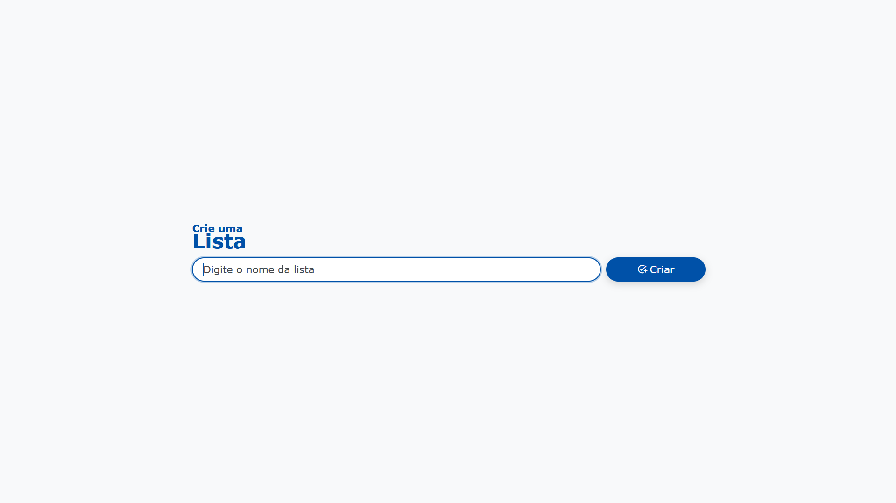
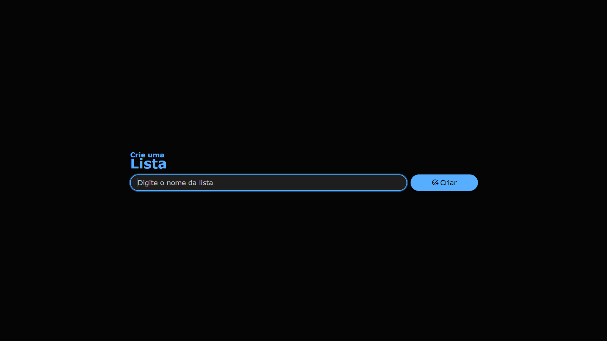
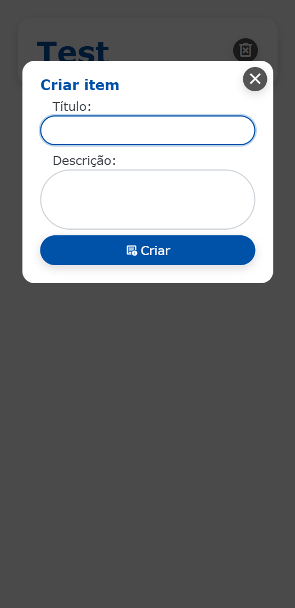
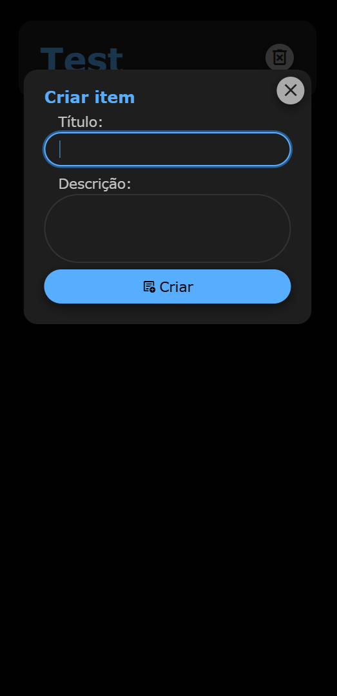
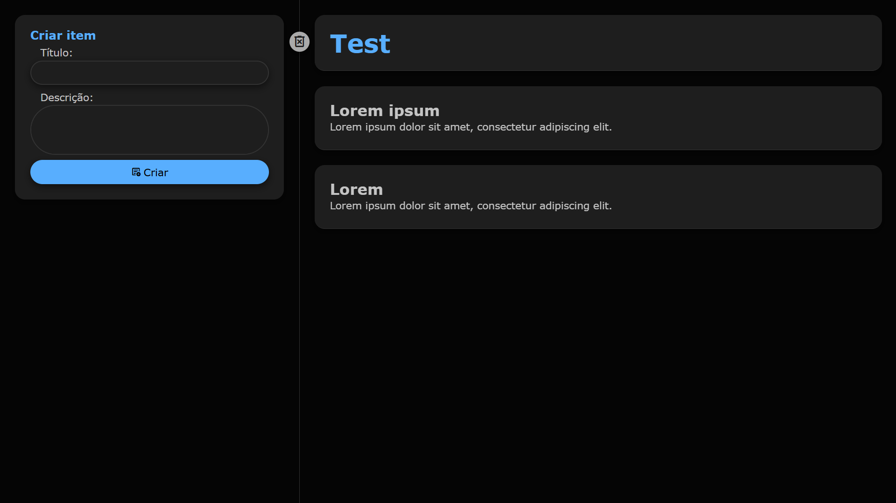

<!-- markdownlint-disable MD033 -->

# 📋 Mini App – Customizable To-Do List with Validation & Feedback

🎯 A lightweight, responsive app to create and manage personalized lists with client-side validation, interactive feedback, and visual accessibility in both light and dark themes.

## ✨ Features

- Add a custom name to your list (with validation)
- Create, display, and remove individual items
- Responsive modal interface on mobile devices
- Visual alerts for success, warnings, and errors
- Theme auto-adaptation based on OS preference (light/dark)
- Accessible contrast ratio (>7) for better readability

## 📸 Screenshots

### 🌓 Theme auto-detection (Light & Dark)




### 📱 Mobile Modal (small screens only)

<p align="center">
  
  
</p>

### 🔷 Modal (large screens)



## 🧠 Technologies

- HTML5
- CSS3 (Responsive Design + Dark Mode)
- JavaScript (DOM Manipulation + Session Storage)

## 🚀 Live Demo

- [](https://mateusaraujos.github.io/mini-app-lista/)
- [](https://mini-app-lista.vercel.app)

## 💻 How to Run Locally

1. Clone this repository:

   ```sh
   git clone https://github.com/mateusaraujos/mini-app-lista
   ```

2. Navigate into the project directory:

   ```sh
   cd mini-app-lista
   ```

3. Open the `index.html` file in your browser.

## 📁 Project Structure

```sh
mini-app-lista/
├── index.html
├── style.css
├── script.js
├── pages/
│   ├── list.html
│   ├── list.css
│   └── list.js
└── assets/
    └── readme/
        ├── homeInterface-light.png
        ├── homeInterface-dark.png
        ├── mobileModal-light.png
        ├── mobileModal-dark.png
        └── modalLarge.png
```

## 👤 Developed by

- [](https://github.com/mateusaraujos)
- [](https://www.linkedin.com/in/mateusaraujos/)
